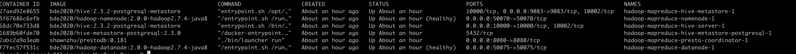
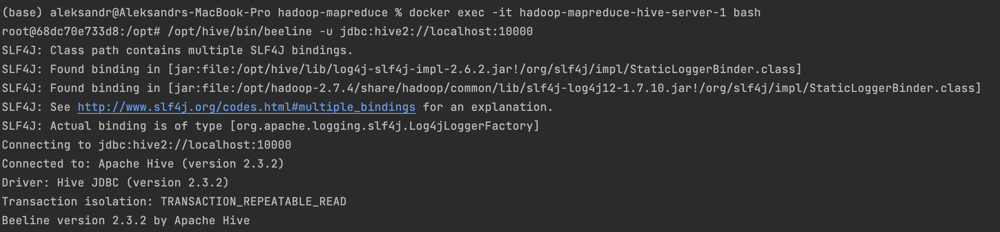
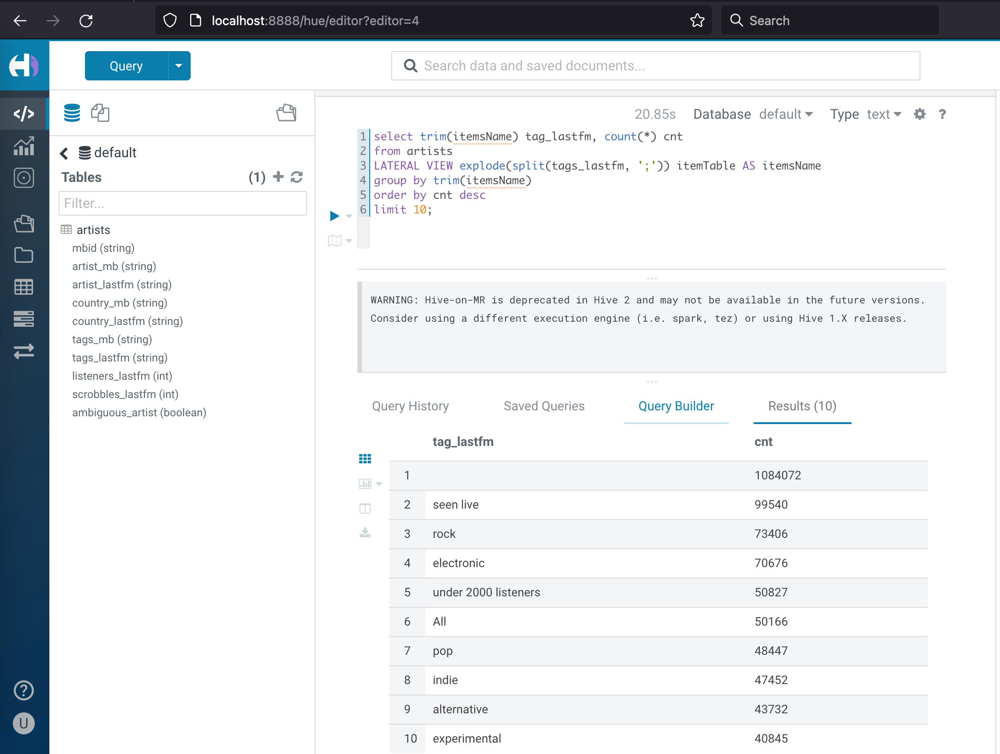
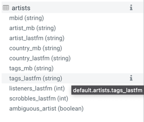
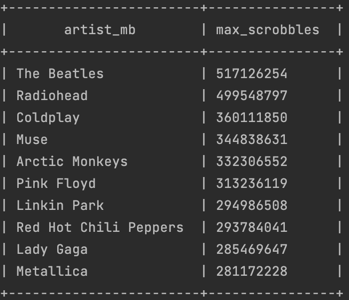
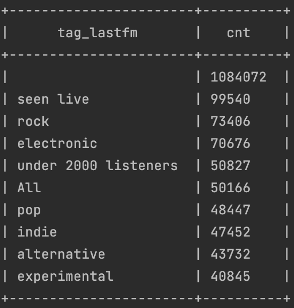

# HW 2
## Block 1
Используются те же образы из bde2020:
Apache Hadoop, Apache Hive, Apache Spark, Jupyter

| Service Name  | Port Number |
| ------------- | ------------- |
| Hadoop name node  | 50070  |
| Hadoop data node  | 50075  |
| Hive server | 10000 |
| Postgres | 5433 |
| Hue | 8888 |

### Подключение через beeline

### Подключение через hue

## Block 2
Команды расположены в файле block_2/commands.txt
### Сделать таблицу artists в Hive и вставить туда значения, используя датасет

### Исполнителя с максимальным числом скробблов

### Самый популярный тэг на ластфм

