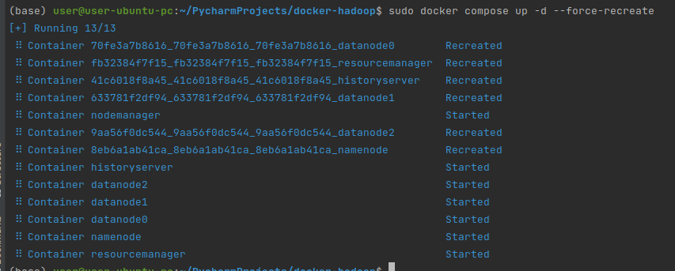
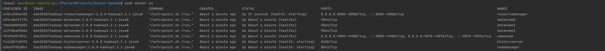
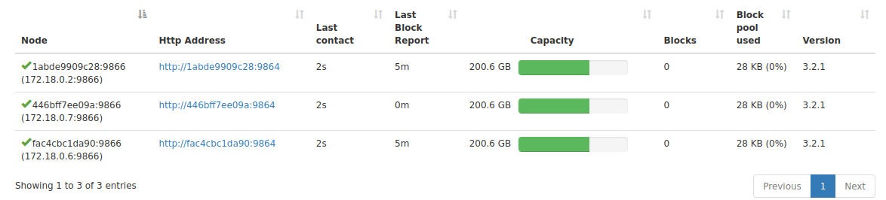
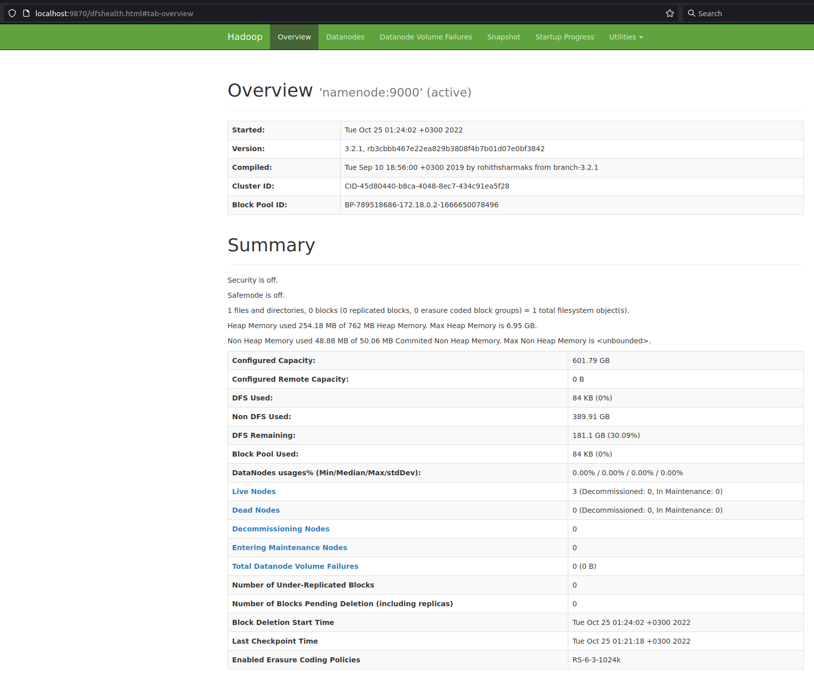
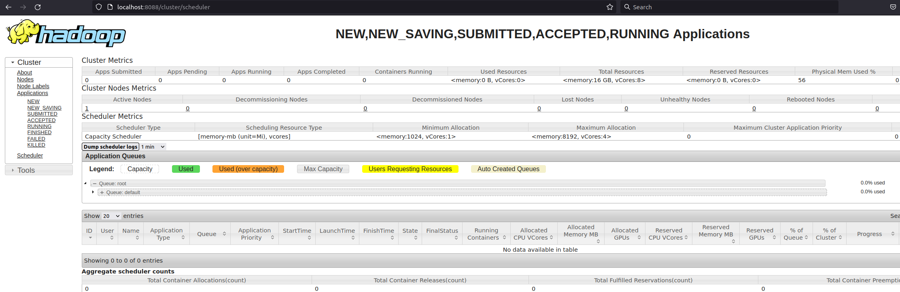
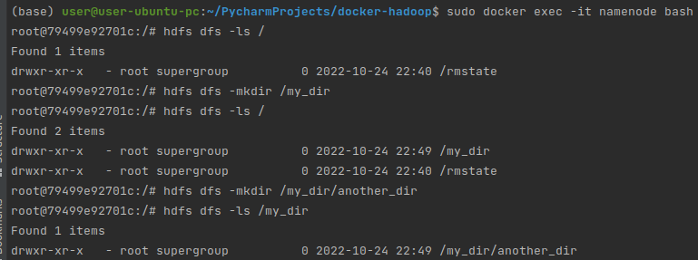
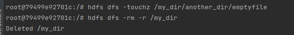
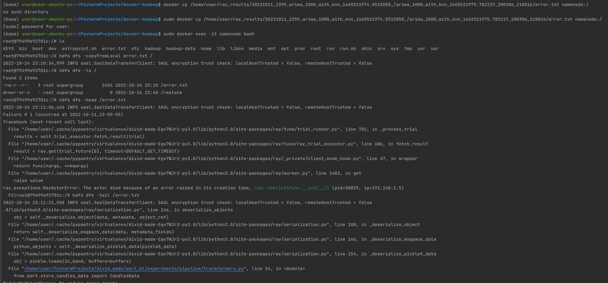
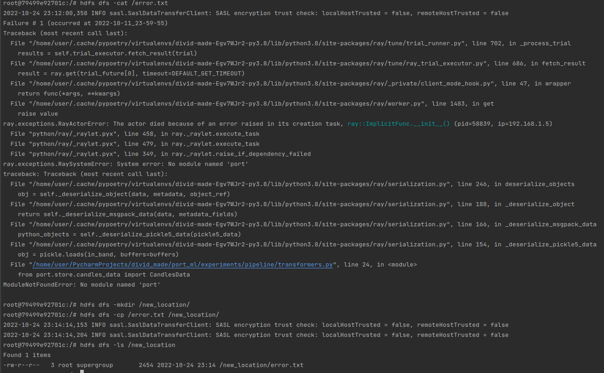
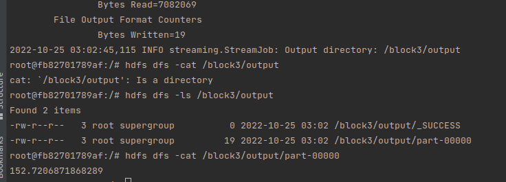

# HW 
## Блок 1. Развертывание локального кластера Hadoop
### Развернуть локальный кластер в конфигурации 1 NN, 3 DN + NM, 1 RM, 1 History server
  
  
### Изучить настройки и состояние NM и RM в веб-интерфейсе
  
### Сделать скриншоты NN и RM, добавить в репозиторий
  
  
## Блок 2. Работа с HDFS
### Выполните задания, записав выполненные команды последовательно в текстовый файл
Текстовый файл тут: **block2_commands.txt**
#### См. флаги “-mkdir” и “-touchz“  
##### 1 & 2  
  
##### 3  
Trash папка это /user/<username>/.Trash/Current, туда падают файлы после удаление, пока fs.trash.interval не истечёт. Чтобы скипнуть, нужно сделать --skipTrash.
##### 4, 5, 6
  
#### См. флаги “-put”, “-cat”, “-tail”, “-cp”
##### 1, 2, 3, 4, 5
Файл с тектом ошибки, поэтому выглядит не очень:(
  
  
## Блок 3. Написание map reduce на Python
Среднее и дисперсия стандартным способом: 152.7206871868289 и 240.15416974718727
```
print(pd.read_csv('AB_NYC_2019.csv')['price'].dropna().mean())
```
Среднее посчитанное MR: 152.7206871868289
  
Код и outputs в **block3/**

# Запуск
```
make build
docker compose up
```